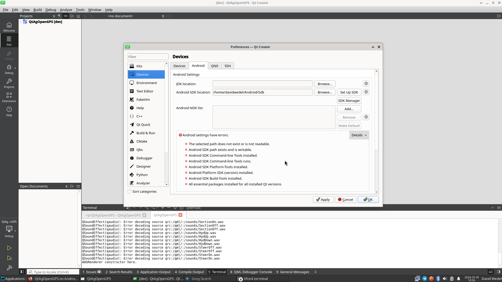
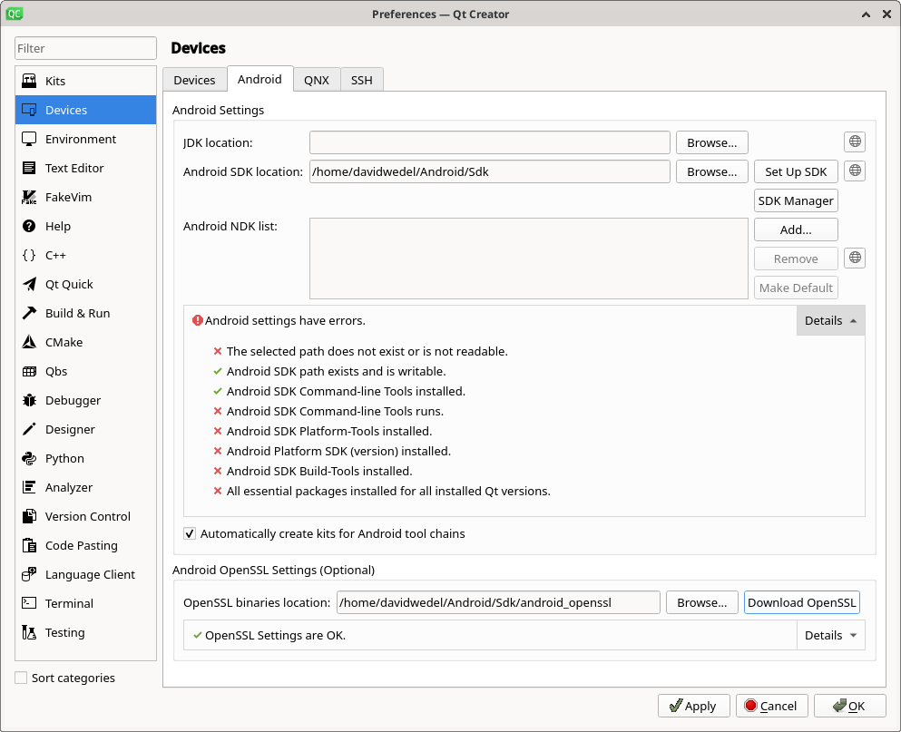
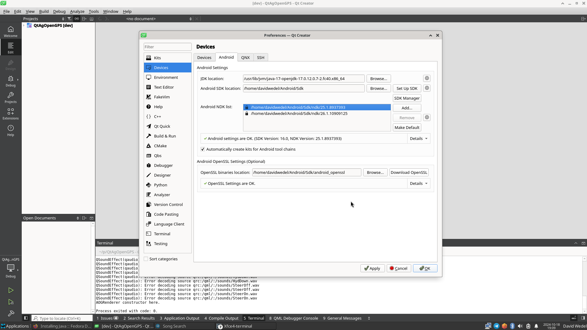
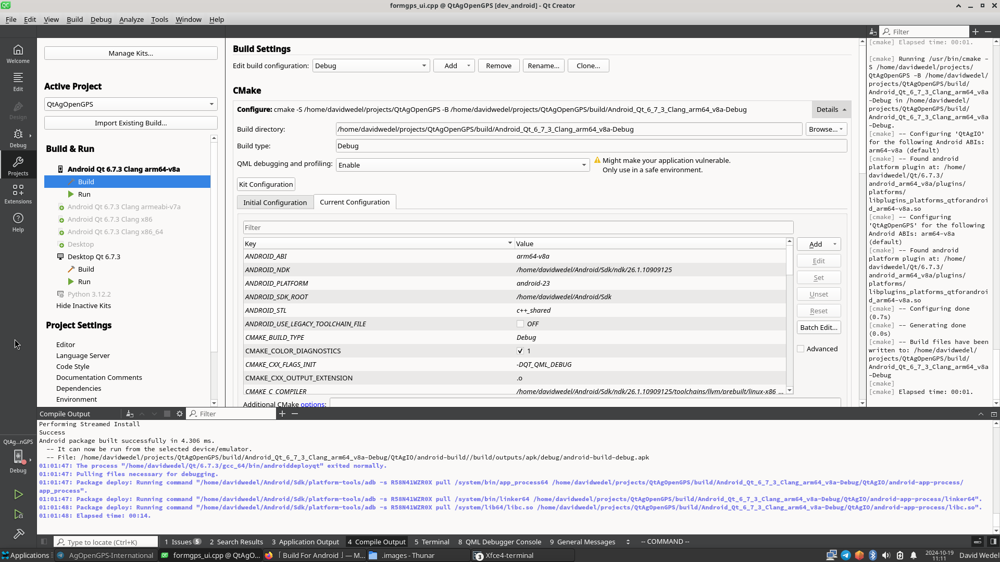

# Compiling for Android 
Warning: If you cannot build QtAOG on your desktop, do not attempt this. It must build on your desktop to work here. See [Installing And Compiling](https://github.com/Davidwedel/QtAgOpenGPS/wiki/Installing-and-Compiling) if you have not done so.

## Configure Android Settings in QtCreator
Click "Configure Android" in the bottom Right. If you don't see, select Edit > Preferences > Devices > Android<br>
You'll see a page like this:

Click "Set Up SDK"<br>
Wait for QtCreator to set up SDK<br>
Scroll Down and click "Download OpenSSL"

Note that there will still be a few warnings. We need to install OpenJDK.

Fedora:
```
sudo dnf install java-17-openjdk-devel
```
apt based:
```
sudo apt install openjdk-17-jdk
```

Next, set the JDK Location. Click "Browse" <br>
Mine was in /usr/lib/jvm (see Location in next screenshot if needed.<br>
Then, QtCreator will display a warning about missing packages. Install them.
And it all works!

You are ready to start building for android.

## Adding Android Device in QtCreator
Plug your Android Device into your computer over usb.<br>
Note: you might have to enable USB debugging on your Android Device. <br>
See https://developer.android.com/studio/debug/dev-options section on USB debugging.<br>
Navigate to the Devices page. (Edit > Preferences > Devices from the main screen if needed)

I had to close and re-open this window before QtCreator would show the device.<br>
Click "Apply" and "OK"<br>

Now, back in main screen:

Select "Android Qt 6.7.3 clang-arm64-v8a" as I have done.<br>
Click "Run"! <br>
Again, it will take a bit to compile. But it should eventually.<br>
Enjoy!

