# Prequisites
## Java
Install Java SE, latest version.  Go to https://www.oracle.com/ca-en/java/technologies/downloads/ and download the Windows installer for the Java JDK.  At the time of this writing, 23.0.1 is the latest.

## Hyper-V
If you intend to use the Android emulator for testing purposes, you will need to enable Hyper-V support in Windows. To enable this feature, click on the Windows start button and search for "features."  Click on "Turn Windows features on or off."

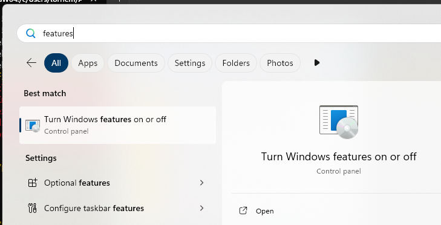

When the "Windows Features" dialog appears, scroll down and check the box next to "Hyper-V" and click "OK."  You will then be prompted to reboot Windows.

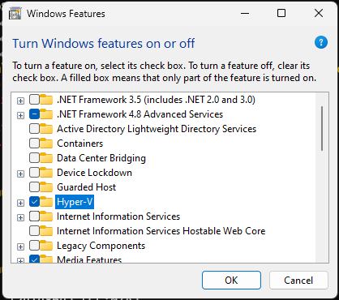

## Visual Studio Command-line compiler (optional)

To build binaries on Windows for Windows we recommend the Microsoft MSVC C++ compiler because it is faster. If do not have Visual Studio installed, you can install "Build Tools for Visual Studio" which include the MSVC compiler suite and command-line build tools.  They can be found at https://visualstudio.microsoft.com/downloads/.  Scroll down towards the bottom of the page and open the "Tools for Visual Studio" section.  Click on the Download button for "Build Tools for Visual Studio."

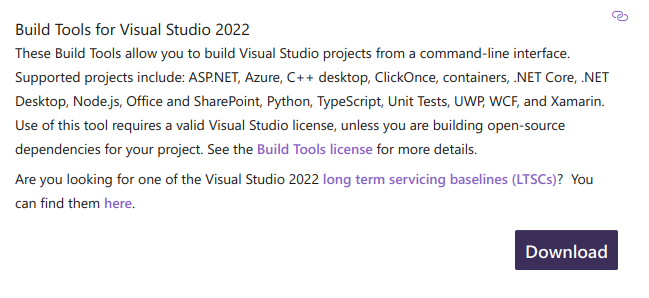

Select the "Desktop development with C++" option and click "Install."

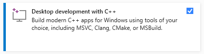

Only 6.8 GB later, you have a working command-line C++ compiler.  Amazing world we live in.

## Git (optional)
You may wish to install "git" to allow Qt Creator to integrate with git source code repos such as those hosted on github or other places including your local repositories.  Advanced features like branching and merging are supported by the Qt Creator IDE.  Install from the official download at https://git-scm.com/downloads/win.  I recommend you select the installer option to "Add a Git Bash Profile to Windows Terminal."

If you plan to use git from the command line and if you are not familiar with how to use the Vim text editor, I recommend that when the installer asks you what editor to use for commit messages, change it to Notepad.

# Install Qt
Download and run the Qt installer from https://www.qt.io/download-qt-installer-oss.  You will need to create a Qt Project account with you email address. We will want to install the latest version of Qt 6.  At the time of this writing is 6.8.0.  In the installer, expand the 6.8.0 item and choose add the following individual parts:

 * "MSVC 2022" if you have Visual Studio or the Build Tools for Visual Studio installed, otherwise choose "MingW 64-bit"
 * Android

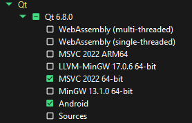

Under "Additional Libraries" select the following:

 * Qt 5 Compatibility Module
 * Qt Image Formats
 * Qt Multimedia
 * Qt Positioning
 * Qt Serial Port

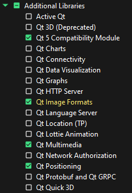

# Setup Android Device in Qt Creator  
Launch Qt Creator and select "Edit->Preferences."  Then click on "Devices" and then select the "Android" tab.  Click on the "Setup SDK" button.

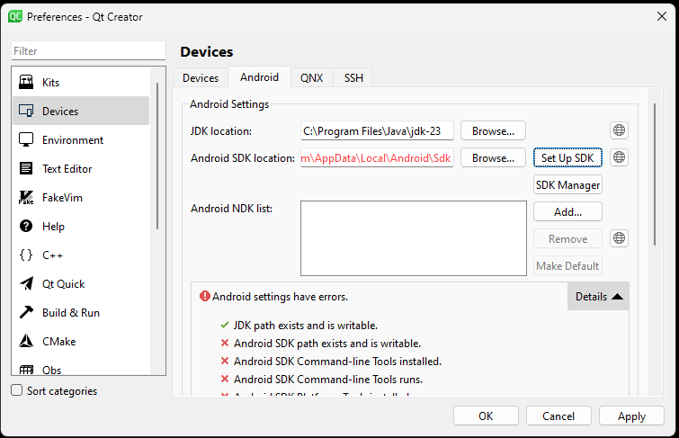

Qt Creator will ask if you want to install missing packages. Click "Yes."  

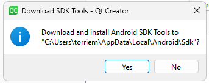

Qt Creator will ask you if you want to install missing packages.  Select "OK."

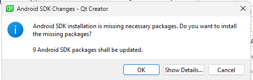

You will have to click "Yes" several times to accept license agreements.

The dialog should now look like this:

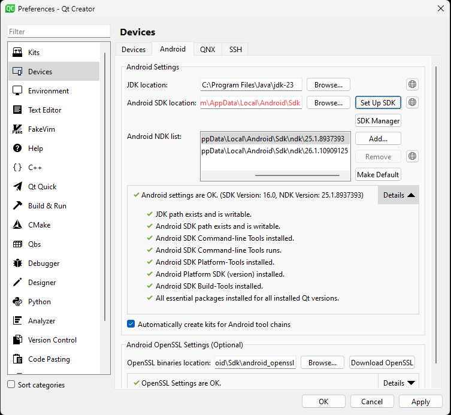

# Android Emulator
## Install components
To install the necessary components to create and run an android emulator for faster testing, click on the "Manage SDK" button.  Type "emulator" in the search field, open the "Tools" section and check the box next to "Android Emulator."

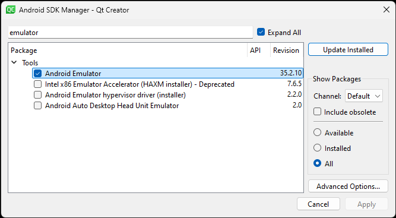

We also require an Android system image to be installed.  Type "intel" in the search field, open the section corresponding with the latest Android version (Version 14 as of this writing), and locate the "Intel x86_64 Atom System Image" item and check the box.  On recent versions of the Android SDK, only x86_64 emulators are supported on Windows.

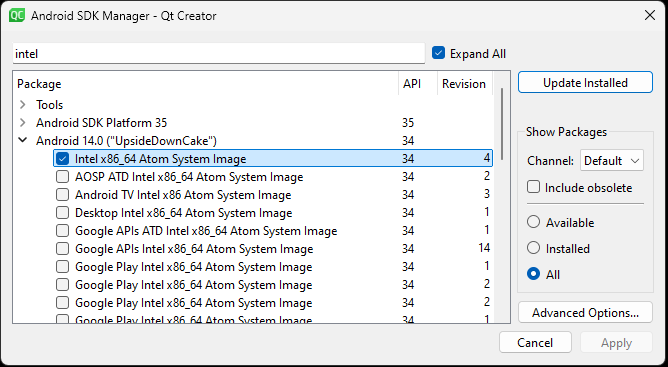

## Create virtual device
To create a virtual Android device, under Qt Creator's preferences, Devices section, click on the "Devices" tab.  Click on the "Add..." button.  Select "Android Device" and click on "Start Wizard."

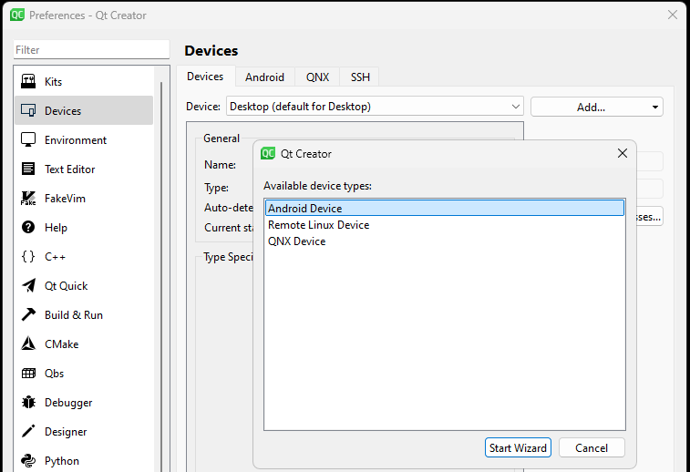

Give your device a name, such as "testemu."  Make sure the architecture is set to "x86_64" as no other architecture is currently supported by the Android emulator on Windows.  
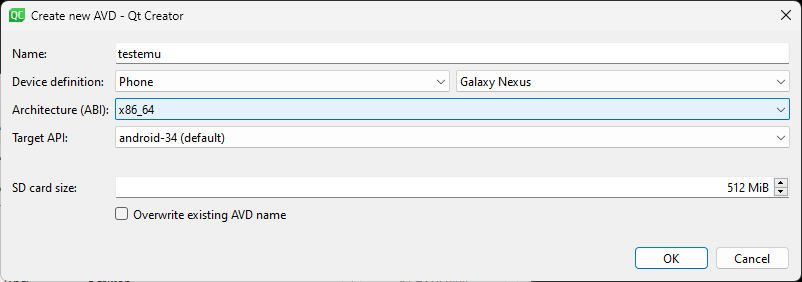

If you wish to emulate a tablet rather than a phone, you can change the "Device definition."

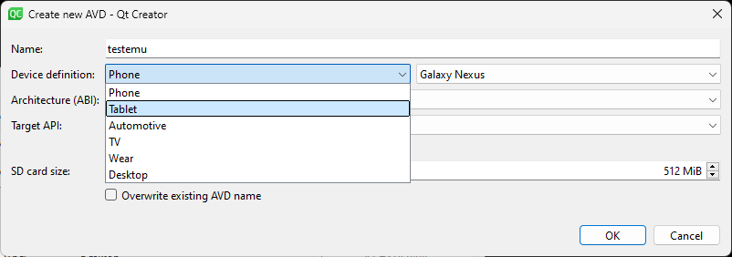

Once the virtual device is created, it can be started automatically by Qt Creator when needed, or you can start it now by clicking on "Start AVD."  The emulator takes several minutes to start up, and the yellow dot will turn green when it's running. You will also see the emulator in a window. It will boot up just like a regular Android device does.

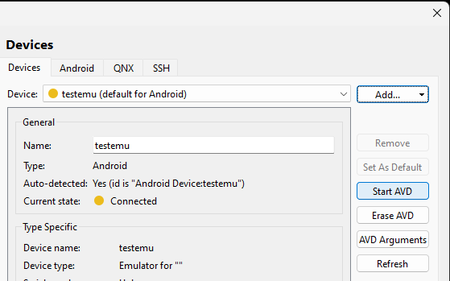

# Verify Qt kits are set up for Android.
QT Creator is now set up for Android develop. Verify that the necessary Qt kits are configured.  In the Qt Creator preferences dialog, click on the "Kits" section.

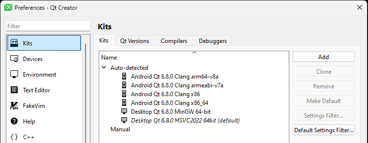

If you don't see the Android entries, click on "Qt Versions." It should look like this:

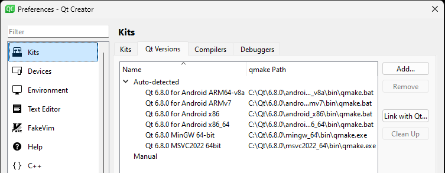

And compilers should look like this:

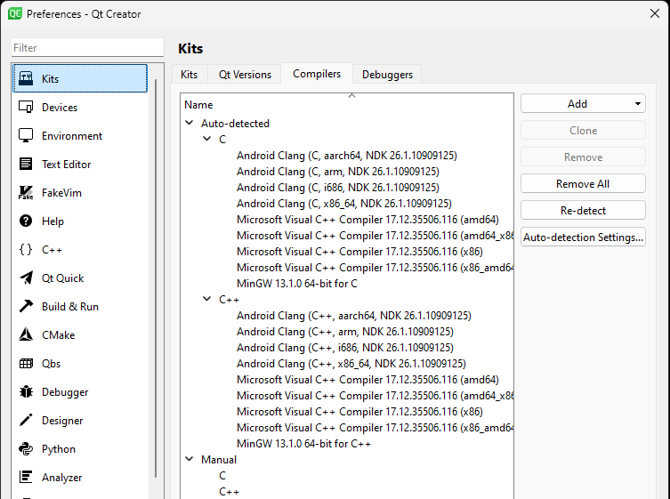

If you don't see the compilers for Android, try clicking on the "Re-detect" button. Also you may have to close Qt Creator and restart it.

Once the kits are populated you are now ready to build and debug for Windows or Android.
